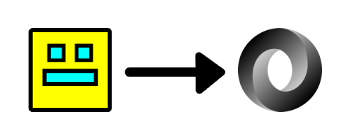

<p align="center"></p>

# Geometry Dash Level to JSON
**gd-level-to-json** | [gd-level-to-json-cli](https://github.com/bwbjustin/gd-level-to-json-cli)

Convert a Geometry Dash level's data to a readable JSON format.


# Features
GD Level to JSON is exported as a function that takes in Geometry Dash level data, whether if it is encrypted or unencrypted.

```js
const fs = require("fs");
const path = require("path");
const convert = require("gd-level-to-json");

console.log(convert(fs.readFileSync(path.resolve(__dirname, "level.txt")).toString())); // { properties: { ... }, objects: [ ... ] }
```

# License
This package is licensed under the [MIT License](./LICENSE).